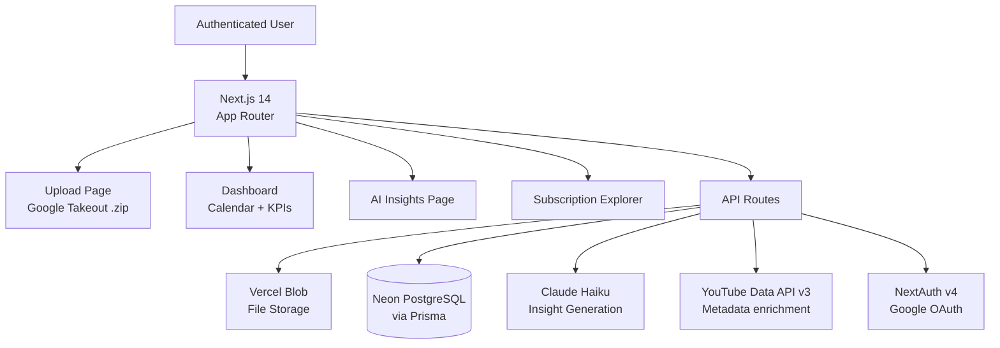
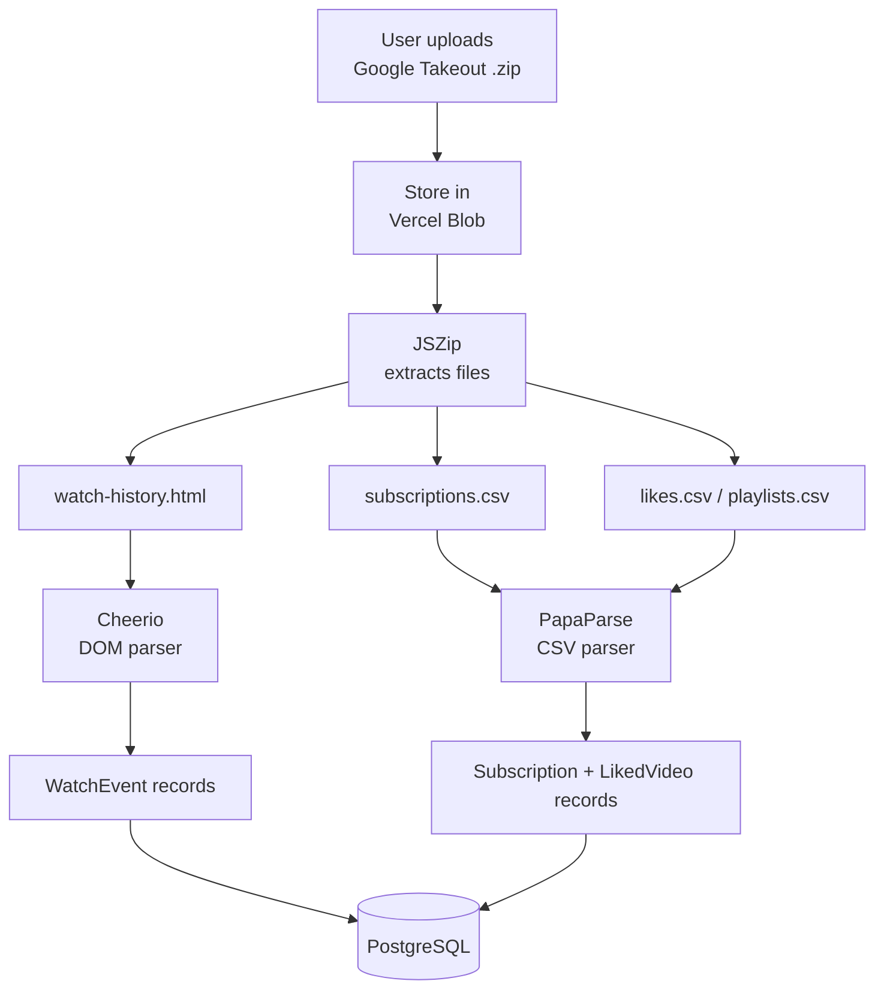
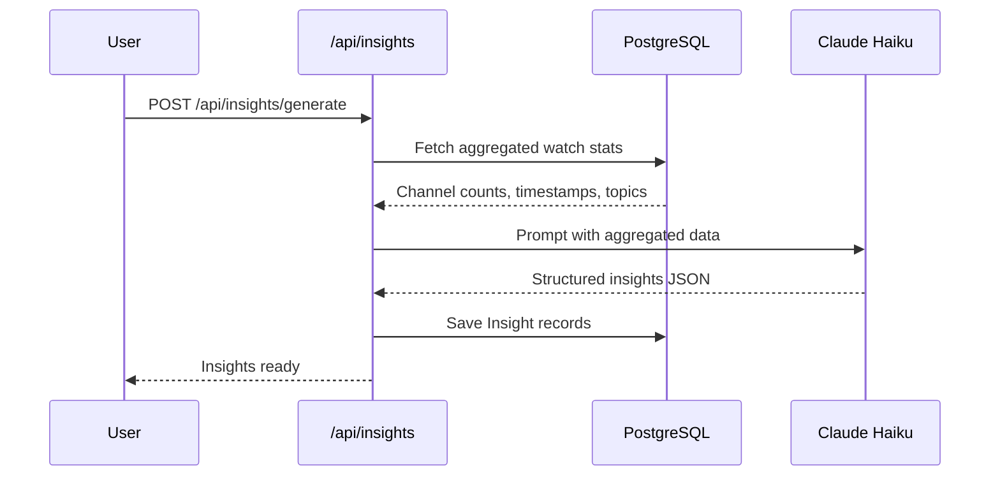
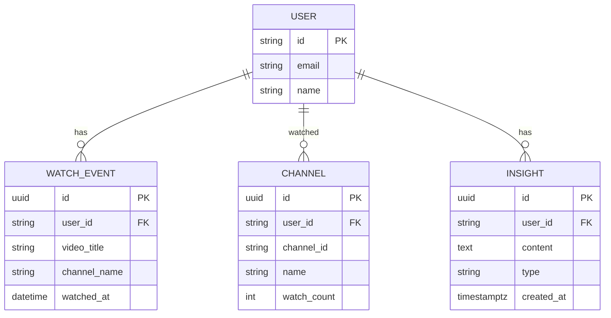

# Architecture Diagrams — Tubelens

## System Architecture

```mermaid
graph TD
    User[Authenticated User] --> Next[Next.js 14\nApp Router]
    
    Next --> Upload[Upload Page\nGoogle Takeout .zip]
    Next --> Dashboard[Dashboard\nCalendar + KPIs]
    Next --> Insights[AI Insights Page]
    Next --> Subs[Subscription Explorer]
    
    Next --> API[API Routes]
    API --> Blob[Vercel Blob\nFile Storage]
    API --> DB[(Neon PostgreSQL\nvia Prisma)]
    API --> Claude[Claude Haiku\nInsight Generation]
    API --> YT[YouTube Data API v3\nMetadata enrichment]
    API --> Auth[NextAuth v4\nGoogle OAuth]
```

## Upload & Parse Pipeline

```mermaid
flowchart TD
    A[User uploads\nGoogle Takeout .zip] --> B[Store in\nVercel Blob]
    B --> C[JSZip\nextracts files]
    C --> D[watch-history.html]
    C --> E[subscriptions.csv]
    C --> F[likes.csv / playlists.csv]
    
    D --> G[Cheerio\nDOM parser]
    E --> H[PapaParse\nCSV parser]
    F --> H
    
    G --> I[WatchEvent records]
    H --> J[Subscription + LikedVideo records]
    
    I --> DB[(PostgreSQL)]
    J --> DB
```

## AI Insight Generation

```mermaid
sequenceDiagram
    participant U as User
    participant API as /api/insights
    participant DB as PostgreSQL
    participant C as Claude Haiku

    U->>API: POST /api/insights/generate
    API->>DB: Fetch aggregated watch stats
    DB-->>API: Channel counts, timestamps, topics
    API->>C: Prompt with aggregated data
    C-->>API: Structured insights JSON
    API->>DB: Save Insight records
    API-->>U: Insights ready
```

## Database Schema (Key Models)

```mermaid
erDiagram
    USER {
        string id PK
        string email
        string name
    }
    WATCH_EVENT {
        uuid id PK
        string user_id FK
        string video_title
        string channel_name
        datetime watched_at
    }
    CHANNEL {
        uuid id PK
        string user_id FK
        string channel_id
        string name
        int watch_count
    }
    INSIGHT {
        uuid id PK
        string user_id FK
        text content
        string type
        timestamptz created_at
    }
    USER ||--o{ WATCH_EVENT : has
    USER ||--o{ CHANNEL : watched
    USER ||--o{ INSIGHT : has
```
